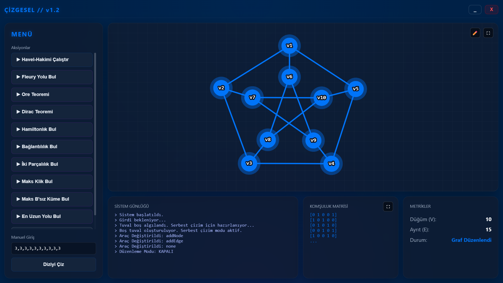

# 🕸️ Çizgesel v1.2 Şablon(Şu Anlık) - Gelişmiş Graf Teorisi Analiz Motoru

Çizgesel, graf teorisi problemlerini çözmek ve görselleştirmek için geliştirilmiş **hibrit mimarili** bir ağ analiz aracıdır. 

Arka planda ağır matematiksel hesaplamalar için **MATLAB App Designer** çalışırken, ön yüzdeki interaktif çizimler ve animasyonlar **Cytoscape.js** (V8 JavaScript Motoru) ile sağlanmaktadır. Bu iki yapı birbirleriyle eşzamanlı olarak **JSON tabanlı bir köprü mimarisi** üzerinden haberleşir.

## ✨ Öne Çıkan Özellikler

Bu projenin en büyük mühendislik özelliği; arka plandaki hiçbir algoritmanın MATLAB'ın yerleşik (built-in) ağ analiz fonksiyonlarını (`conncomp`, `maxclique`, `shortestpath` vb.) **KULLANMAMASIDIR**. Tüm çözücüler sıfırdan, iteratif ve yığın (stack) tabanlı olarak yazılmıştır.

*   **👑 Maksimum Klik Bulma:** Yakında...
*   **🧊 Maksimum Bağımsız Küme:** Yakında...
*   **⛓️ En Uzun Yol (Çap) Arama:** Yakında...
*   **🎭 İki Parçalı (Bipartite) Analizi:** Yakında...
*   **🏗️ Havel-Hakimi ile Çizim:** Yakında...
*   **🎨 Siber-Estetik Görselleştirme:** Cytoscape.js kullanılarak "Neon/Hayalet (Blueprint) Efekti" ile dinamik yol ve küme vurgulamaları.

## 🛠️ Kullanılan Teknolojiler

*   **Backend:** MATLAB (App Designer) & C/C++ tabanlı saf matris işlemleri
*   **Frontend:** HTML5, CSS3, JavaScript
*   **Görselleştirme Kütüphanesi:** [Cytoscape.js](https://js.cytoscape.org/)
*   **İletişim Protokolü:** JSON (JavaScript Object Notation) Stringify/Parse köprüsü

## 📸 Ekran Görüntüleri

**Uygulama Arayüzü ve Serbest Çizim**


## 🚀 Kurulum ve Kullanım

1. Bu depoyu bilgisayarınıza klonlayın:
   ```bash
   git clone [https://github.com/m-ayyildiz/Cizgesel.git](https://github.com/m-ayyildiz/Cizgesel.git)
